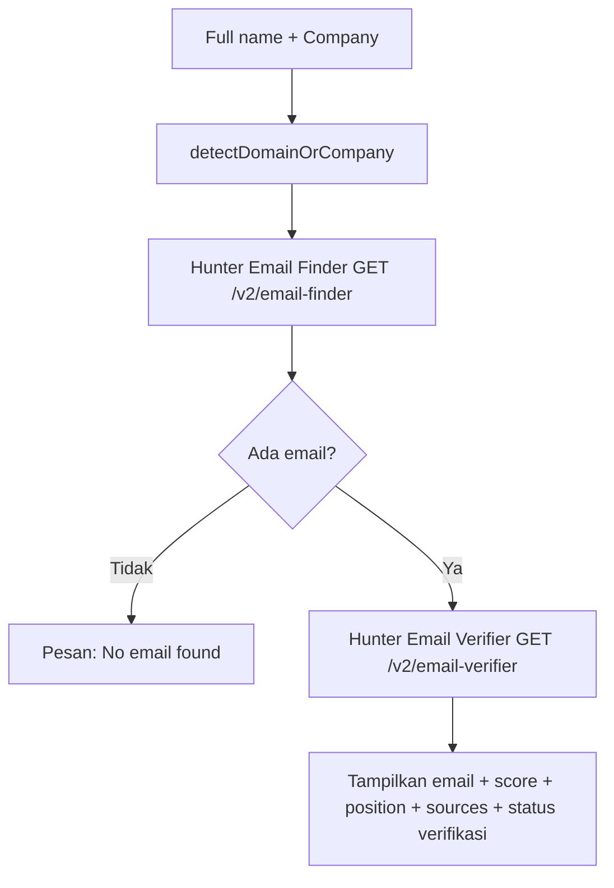
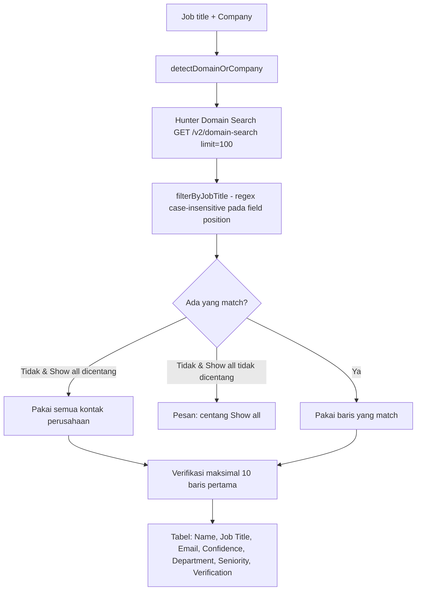

# Dokumentasi Modul Contact Finder

Modul **Contact Finder** adalah klien tipis (stateless proxy) untuk **Hunter.io API**
di dalam **Rouge Automation Dashboard**. Tidak ada database, history, atau ekspor —
input diterima, diteruskan ke Hunter.io, hasilnya ditampilkan sebagai tabel.

Desainnya mengikuti aplikasi referensi Streamlit
`github.com/parapinich/contact-finder-using-hunter.io` (`app.py`), dengan tambahan
langkah **Email Verifier**.

---

## 1. Dua Mode Pencarian

### Mode A — Search by Name
Input: **Full name** + **Company**. Alur:



### Mode B — Search by Job Title
Input: **Job title** + **Company** + checkbox **Show all contacts**. Alur:



`detectDomainOrCompany(text)`: kalau input mengandung `.` dan tanpa spasi → dikirim
sebagai param `domain` (lowercase); selain itu sebagai param `company` (Hunter yang
me-resolve ke domain).

Retry plan-limit: kalau Domain Search error `limited to N email addresses`, request
diulang sekali dengan `limit=N`.

---

## 2. Struktur File

| File | Peran |
| --- | --- |
| [lib/contact-finder/hunterClient.ts](file:///d:/Rouge-Dashboard/lib/contact-finder/hunterClient.ts) | Wrapper Hunter.io: `callHunter`, `detectDomainOrCompany`, `filterByJobTitle`, `emailFinder`, `domainSearch`, `verifyEmail` |
| [lib/contact-finder/routeHelpers.ts](file:///d:/Rouge-Dashboard/lib/contact-finder/routeHelpers.ts) | `hunterErrorResponse` — pemetaan error ke HTTP status |
| [lib/contact-finder/hunterClient.selfcheck.ts](file:///d:/Rouge-Dashboard/lib/contact-finder/hunterClient.selfcheck.ts) | Cek helper murni (`npx tsx ...`) |
| [types/contact-finder.ts](file:///d:/Rouge-Dashboard/types/contact-finder.ts) | Tipe request/response kedua mode |
| [app/api/contact-finder/email-finder/route.ts](file:///d:/Rouge-Dashboard/app/api/contact-finder/email-finder/route.ts) | `POST /api/contact-finder/email-finder` |
| [app/api/contact-finder/domain-search/route.ts](file:///d:/Rouge-Dashboard/app/api/contact-finder/domain-search/route.ts) | `POST /api/contact-finder/domain-search` |
| [components/ContactFinderTool.tsx](file:///d:/Rouge-Dashboard/components/ContactFinderTool.tsx) | UI 2 tab |
| [app/(route)/tools/contact-finder/page.tsx](file:///d:/Rouge-Dashboard/app/(route)/tools/contact-finder/page.tsx) | Halaman + `ToolPageWrapper` (role gate) |

Tidak ada tabel database dan tidak ada `lib/contact-finder/database.ts`.

---

## 3. Endpoints REST API

Kedua endpoint butuh session Next-Auth (cookie `next-auth.session-token`) → tanpa
session balas `401`. Validasi: kedua field wajib (`400`) dan maksimal 255 karakter.

### `POST /api/contact-finder/email-finder`
**Request**
```json
{ "fullName": "Patrick Collison", "company": "stripe.com" }
```
**Response (200)**
```json
{
  "success": true,
  "email": "patrick@stripe.com",
  "score": 97,
  "position": "Chief Executive Officer",
  "company": "Stripe",
  "domain": "stripe.com",
  "sources": [{ "uri": "https://stripe.com/about" }],
  "verification": { "status": "valid", "score": 100 }
}
```
Tidak ketemu → `{ "success": true, "email": null, "message": "No email found for that name and company." }`

### `POST /api/contact-finder/domain-search`
**Request**
```json
{ "jobTitle": "Engineer", "company": "stripe.com", "showAll": false }
```
**Response (200)**
```json
{
  "success": true,
  "company": "stripe.com",
  "domain": "stripe.com",
  "jobTitle": "Engineer",
  "matchedCount": 3,
  "totalCount": 42,
  "showingAll": false,
  "contacts": [
    {
      "name": "Jane Roe",
      "position": "Senior Software Engineer",
      "email": "jane@stripe.com",
      "confidence": 89,
      "department": "it",
      "seniority": "senior",
      "verification": { "status": "valid", "score": 95 }
    }
  ]
}
```
`showingAll: true` ketika tidak ada yang match tapi `showAll` dicentang (menampilkan
seluruh kontak perusahaan). `contacts` di luar 10 baris pertama punya
`verification: null`.

### Pemetaan error (`hunterErrorResponse`)
| Kondisi | HTTP |
| --- | --- |
| `HUNTER_API_KEY` tidak diset | 500 "Hunter.io API is not configured." |
| Hunter 401 (key salah) | 500 "Invalid API key." |
| Hunter 429 / limit tercapai | 429 |
| lainnya | 500 dengan pesan error |

---

## 4. Konfigurasi Lingkungan

```env
HUNTER_API_KEY=isi_dengan_api_key_hunter_io_anda
```
Diambil dari `process.env.HUNTER_API_KEY` di server; tidak pernah dimasukkan lewat UI.
API key gratis dari https://hunter.io/api-keys. Endpoint enrichment/verifier gratis;
Email Finder & Domain Search memakai credit per hasil.
