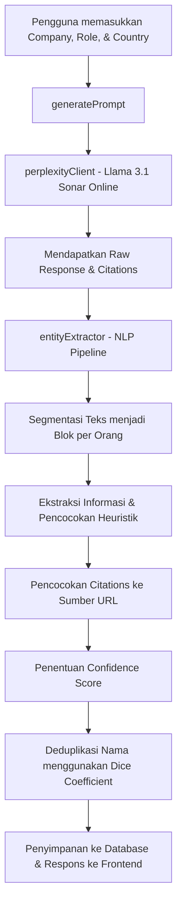

# Dokumentasi Modul Contact Finder

Modul **Contact Finder** adalah fitur pencarian kontak profesional berbasis AI yang diintegrasikan ke dalam **Rouge Automation Dashboard**. Fitur ini memanfaatkan API Perplexity AI untuk menjelajahi sumber publik di internet dan menggunakan pipeline NLP (Named Entity Recognition) berbasis pola untuk mengekstrak, membersihkan, dan menstandardisasi informasi kontak (seperti Nama, Jabatan, Email, Telepon, dan URL Media Sosial) ke dalam bentuk terstruktur.

---

## 1. Alur Kerja (Workflow) Sistem
Berikut adalah visualisasi alur proses dari input pengguna hingga penyimpanan data ke database:



---

## 2. Struktur File & Modul Kode
Modul ini terbagi menjadi beberapa komponen utama di dalam folder `lib/contact-finder`, `types`, `utils`, dan `app/api`:

*   **Tipe Data**:
    *   [contact-finder.ts](file:///d:/Rouge-Dashboard/types/contact-finder.ts) - Definisi tipe TypeScript bersama (`ConfidenceLevel`, `ContactEntity`, `ContactFinderResult`, `ContactFinderSearch`, dll.).
*   **Logika Backend**:
    *   [promptGenerator.ts](file:///d:/Rouge-Dashboard/lib/contact-finder/promptGenerator.ts) - Membuat kueri pencarian multi-sumber yang dioptimalkan untuk AI.
    *   [perplexityClient.ts](file:///d:/Rouge-Dashboard/lib/contact-finder/perplexityClient.ts) - Mengirimkan permintaan pencarian ke Perplexity AI API.
    *   [entityExtractor.ts](file:///d:/Rouge-Dashboard/lib/contact-finder/entityExtractor.ts) - Pipeline NLP NER (Named Entity Recognition) berbasis Regex dan Heuristik.
    *   [database.ts](file:///d:/Rouge-Dashboard/lib/contact-finder/database.ts) - Fungsi pembantu untuk operasi CRUD (Create, Read, Update, Delete) database menggunakan Drizzle ORM.
*   **API Routes**:
    *   [route.ts (Search)](file:///d:/Rouge-Dashboard/app/api/contact-finder/search/route.ts) - Endpoint `POST /api/contact-finder/search` untuk memproses alur pencarian.
    *   [route.ts (History)](file:///d:/Rouge-Dashboard/app/api/contact-finder/history/route.ts) - Endpoint `GET` dan `DELETE` untuk mengambil atau menghapus seluruh riwayat pencarian.
    *   [route.ts (History Detail)](file:///d:/Rouge-Dashboard/app/api/contact-finder/history/%5BsearchId%5D/route.ts) - Endpoint `GET` dan `DELETE` untuk detail atau penghapusan satu sesi riwayat pencarian.
*   **Skema Database**:
    *   [schema.tsx](file:///d:/Rouge-Dashboard/utils/schema.tsx) - Definisi tabel PostgreSQL menggunakan Drizzle ORM (`ContactFinderSearches` dan `ContactFinderResults`).
*   **Frontend UI**:
    *   [ContactFinderTool.tsx](file:///d:/Rouge-Dashboard/components/ContactFinderTool.tsx) - Komponen UI interaktif untuk pencarian, tampilan hasil, ekspor CSV, dan riwayat.

---

## 3. Penjelasan Detail Setiap Komponen

### A. Generator Prompt Pencarian ([promptGenerator.ts](file:///d:/Rouge-Dashboard/lib/contact-finder/promptGenerator.ts))
Fungsi [generatePrompt](file:///d:/Rouge-Dashboard/lib/contact-finder/promptGenerator.ts#L56) membuat prompt pencarian yang dioptimalkan berdasarkan parameter input: `company`, `role`, dan `country`.
*   **Registri Bisnis Negara**: Memetakan negara ke registri bisnis resminya (misal: `AHU (ahu.go.id)` untuk Indonesia, `ACRA (acra.gov.sg)` untuk Singapura) guna menemukan informasi direktur/pejabat resmi secara valid.
*   **Pencarian GitHub Otomatis**: Jika jabatan target termasuk dalam kategori pengembang/teknologi (seperti CTO, VP Engineering, Developer, dll.), GitHub ditambahkan sebagai salah satu sumber pencarian.
*   **Daftar Sumber Publik**: Memaksa AI untuk mencari di LinkedIn, situs web resmi perusahaan (halaman Team/About), Facebook, Instagram, Twitter/X, registri pemerintah, dan GitHub.
*   **Aturan Ketat Pencarian**: Menginstruksikan AI hanya mengembalikan informasi publik yang terkonfirmasi, menulis "Not found" jika tidak ada, dan menghindari spekulasi.

### B. Klien API Perplexity ([perplexityClient.ts](file:///d:/Rouge-Dashboard/lib/contact-finder/perplexityClient.ts))
Fungsi [searchWithPerplexity](file:///d:/Rouge-Dashboard/lib/contact-finder/perplexityClient.ts#L28) menangani komunikasi dengan API Perplexity AI.
*   **Model**: Menggunakan `llama-3.1-sonar-large-128k-online` yang memiliki kapabilitas pencarian web (web search) secara real-time.
*   **Parameter**:
    *   `return_citations: true` untuk mendapatkan daftar URL referensi tempat informasi ditemukan.
    *   `temperature: 0.1` (suhu rendah) agar hasil bersifat lebih faktual, konsisten, dan deterministik.
*   **Penanganan Error**: Mendukung penanganan jika kunci API salah (401), terkena batas kuota/rate limit (429), atau kesalahan server lainnya.

### C. Pipeline Ekstraksi Entitas ([entityExtractor.ts](file:///d:/Rouge-Dashboard/lib/contact-finder/entityExtractor.ts))
Ini adalah bagian inti (NLP NER Pipeline) yang bertugas mengurai teks bebas dari Perplexity menjadi entitas terstruktur melalui fungsi [parseEntities](file:///d:/Rouge-Dashboard/lib/contact-finder/entityExtractor.ts#L507):

1.  **Segmentasi Teks (Text Segmentation)**:
    Memisahkan teks mentah Perplexity menjadi blok data per individu melalui fungsi pembantu `splitIntoPersonBlocks` menggunakan pola daftar bernomor (1., 2.), markdown header (`### Name`), garis pemisah (`---`), atau baris kosong ganda.
2.  **Ekstraksi Menggunakan Regular Expressions (Regex)**:
    *   *Email*: Pola RFC 5322 yang disederhanakan (`/[a-zA-Z0-9._%+\-]+@[a-zA-Z0-9.\-]+\.[a-zA-Z]{2,}/g`).
    *   *Telepon*: Pola nomor telepon internasional dengan panjang minimal 7 digit guna menghindari positif palsu (seperti tahun atau ID).
    *   *Media Sosial*: Pola pencarian URL spesifik untuk LinkedIn (`linkedin.com/in/`), Instagram (`instagram.com/`), Facebook (`facebook.com/`), dan Twitter/X (`twitter.com/` atau `x.com/`).
3.  **Ekstraksi Nama & Jabatan (Heuristics)**:
    *   *Nama*: Menggunakan 4 tingkat heuristik pada fungsi `extractName` (label eksplisit `Name: ...`, pola huruf tebal di awal baris `**John Doe**`, baris pertama yang pendek dan diawali huruf kapital, atau pencarian kata berhuruf kapital dekat kata kunci jabatan).
    *   *Jabatan*: Mencocokkan dengan pustaka kata kunci posisi populer (seperti CEO, CTO, VP, Director, Manager, Engineer, dll.) pada fungsi `extractTitle` baik dari label eksplisit maupun teks baris.
4.  **Pemetaan Sumber URL (Source Matching)**:
    Mencocokkan indeks referensi (misal: `[1]`, `[2]`) pada teks per orang ke array `citations` yang dikembalikan oleh Perplexity menggunakan fungsi `matchSourceUrl`.
5.  **Penentuan Confidence Level**:
    Ditentukan pada fungsi `assignConfidence` berdasarkan kelengkapan data kontak:
    *   `high`: Memiliki Email AND (LinkedIn ATAU Telepon).
    *   `medium`: Memiliki minimal salah satu dari LinkedIn, Telepon, atau Email (tetapi tidak memenuhi syarat High).
    *   `low`: Hanya menemukan Nama tanpa info kontak terverifikasi lainnya.
6.  **Deduplikasi Nama (Deduplication)**:
    Membandingkan kesamaan nama menggunakan algoritma koefisien kesamaan Dice (Dice's Coefficient) berbasis *bigram* dengan ambang batas (threshold) `0.7` pada fungsi `deduplicateContacts`. Jika ditemukan duplikat, entri dengan tingkat *confidence* lebih tinggi akan dipertahankan.

---

## 4. Skema Database ([schema.tsx](file:///d:/Rouge-Dashboard/utils/schema.tsx))
Dua tabel utama yang digunakan untuk menyimpan sesi dan hasil pencarian:

### Tabel `contact_finder_searches`
Menyimpan sesi pencarian pengguna (Didefinisikan di baris 1274).
```typescript
export const ContactFinderSearches = pgTable("contact_finder_searches", {
  id: uuid("id").defaultRandom().primaryKey(),
  userId: varchar("user_id").notNull(),
  company: varchar("company").notNull(),
  role: varchar("role").notNull(),
  country: varchar("country").notNull(),
  rawResponse: text("raw_response"),
  citations: jsonb("citations").$type<string[]>(),
  createdAt: timestamp("created_at").defaultNow(),
});
```

### Tabel `contact_finder_results`
Menyimpan entitas kontak yang berhasil diekstrak dan dihubungkan ke sesi pencarian (Didefinisikan di baris 1290).
```typescript
export const ContactFinderResults = pgTable("contact_finder_results", {
  id: uuid("id").defaultRandom().primaryKey(),
  searchId: uuid("search_id").notNull().references(() => ContactFinderSearches.id, { onDelete: 'cascade' }),
  name: varchar("name"),
  title: varchar("title"),
  email: varchar("email"),
  phone: varchar("phone"),
  linkedin: varchar("linkedin"),
  instagram: varchar("instagram"),
  facebook: varchar("facebook"),
  twitter: varchar("twitter"),
  source: text("source"),
  confidence: varchar("confidence"), // 'high' | 'medium' | 'low'
  createdAt: timestamp("created_at").defaultNow(),
});
```

---

## 5. Endpoints REST API
Seluruh request API wajib menyertakan autentikasi token JWT (melalui session Next-Auth):

### 1. Cari Kontak (`POST /api/contact-finder/search`)
Menerima kriteria pencarian, memicu pipeline AI & NLP, menyimpan data, dan mengembalikan hasil.
*   **Request Body**:
    ```json
    {
      "company": "Gojek",
      "role": "CTO",
      "country": "Indonesia"
    }
    ```
*   **Response (200 OK)**:
    ```json
    {
      "success": true,
      "searchId": "d3b07384-d113-4ec6-a579-4d6484e56588",
      "company": "Gojek",
      "role": "CTO",
      "country": "Indonesia",
      "contacts": [
        {
          "id": "e2a12903-8822-4bb3-b541-69273c52e46b",
          "searchId": "d3b07384-d113-4ec6-a579-4d6484e56588",
          "name": "Dito",
          "title": "VP of Technology / CTO",
          "email": "dito@gojek.com",
          "phone": "+628123456789",
          "linkedin": "linkedin.com/in/dito-example",
          "instagram": null,
          "facebook": null,
          "twitter": null,
          "source": "https://linkedin.com/in/dito-example",
          "confidence": "high",
          "createdAt": "2026-07-10T11:34:15.000Z"
        }
      ],
      "rawResponse": "...raw text...",
      "citations": ["https://linkedin.com/in/dito-example"],
      "createdAt": "2026-07-10T11:34:15.000Z"
    }
    ```

### 2. Ambil Riwayat Pencarian (`GET /api/contact-finder/history`)
Mendapatkan riwayat pencarian pengguna saat ini (mendukung pagination).
*   **Query Parameters**:
    *   `limit` (default 20, max 100)
    *   `offset` (default 0)
*   **Response (200 OK)**:
    ```json
    {
      "success": true,
      "searches": [
        {
          "id": "uuid",
          "userId": "user@email.com",
          "company": "Grab",
          "role": "CTO",
          "country": "Singapore",
          "createdAt": "..."
        }
      ],
      "total": 1
    }
    ```

### 3. Detail Sesi Pencarian (`GET /api/contact-finder/history/[searchId]`)
Mengambil detail pencarian tertentu lengkap beserta daftar kontak yang berhasil ditemukan.
*   **Response (200 OK)**:
    ```json
    {
      "success": true,
      "search": {
        "id": "uuid",
        "userId": "user@email.com",
        "company": "Grab",
        "role": "CTO",
        "country": "Singapore",
        "contacts": [ ... ]
      }
    }
    ```

### 4. Hapus Riwayat Spesifik (`DELETE /api/contact-finder/history/[searchId]`)
Menghapus riwayat pencarian tertentu (secara otomatis menghapus kontak terkait karena relasi *ON DELETE CASCADE*).

### 5. Hapus Semua Riwayat (`DELETE /api/contact-finder/history`)
Menghapus seluruh riwayat pencarian milik pengguna yang terautentikasi.

---

## 6. Antarmuka Pengguna & Fitur UI ([ContactFinderTool.tsx](file:///d:/Rouge-Dashboard/components/ContactFinderTool.tsx))
UI dibangun dengan pendekatan modern menggunakan library komponen UI (Card, Badge, Input, Select, Tabs, Tooltip dari Shadcn/Radix-UI) dan Lucide Icons:
*   **Bilah Kemajuan Multi-Step (Simulated Loading)**: Menampilkan alur visual pencarian secara dinamis (Prompt -> AI Search -> NLP Extract -> Save) untuk meningkatkan UX saat memanggil API eksternal yang memerlukan waktu.
*   **Penyaringan Confidence**: Menampilkan statistik ringkasan tingkat kepercayaan (High, Medium, Low) dengan badge warna yang berbeda (Hijau, Kuning, Merah).
*   **Interaksi Clipboard Praktis**: Menyediakan tombol klik-untuk-menyalin (Click-to-Copy) pada Email dan Nomor Telepon dengan feedback ikon centang hijau jika berhasil disalin.
*   **Ekspor Data**: Menyediakan tombol untuk mengekspor kontak yang ditemukan ke file CSV secara instan, baik pada hasil pencarian baru maupun dari riwayat lama.
*   **Daftar Riwayat Collapsible**: Pada tab History, pengguna dapat mengeklik baris pencarian lama untuk memicu dropdown interaktif yang menampilkan daftar kontak hasil pencarian tersebut secara dinamis.

---

## 7. Konfigurasi Lingkungan (Environment Variables)
Fitur ini membutuhkan API Key dari Perplexity AI yang dikonfigurasi di dalam file `.env.local`:
```env
PERPLEXITY_API_KEY=isi_dengan_api_key_perplexity_anda
```
